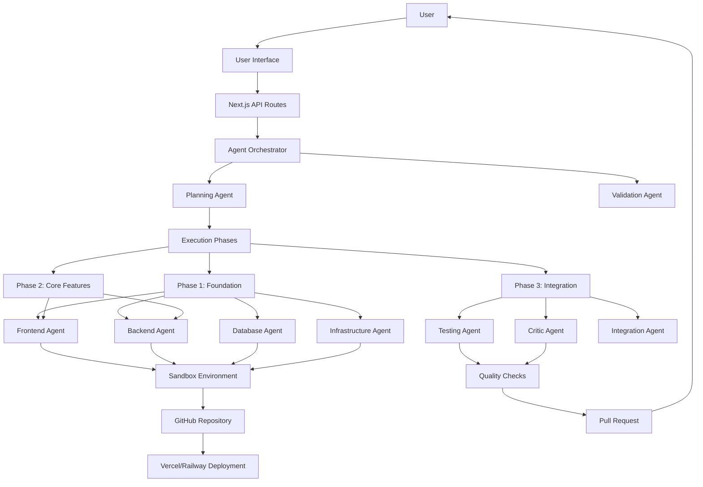
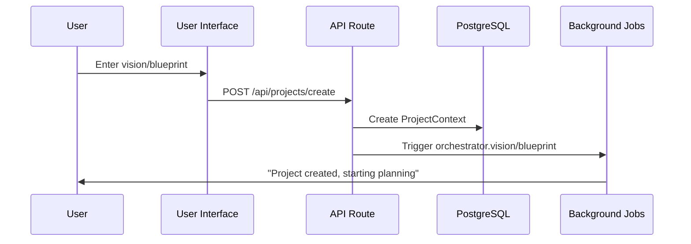
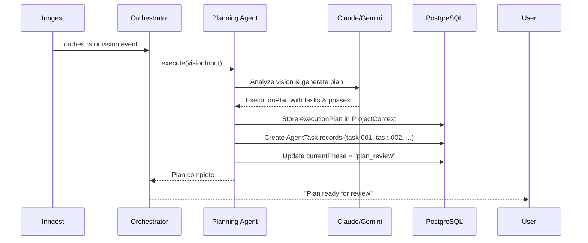
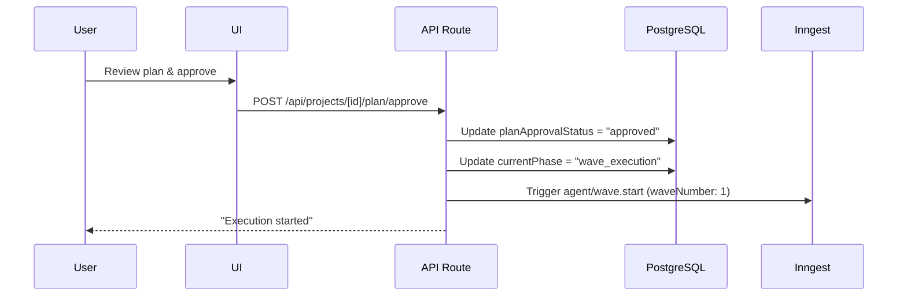
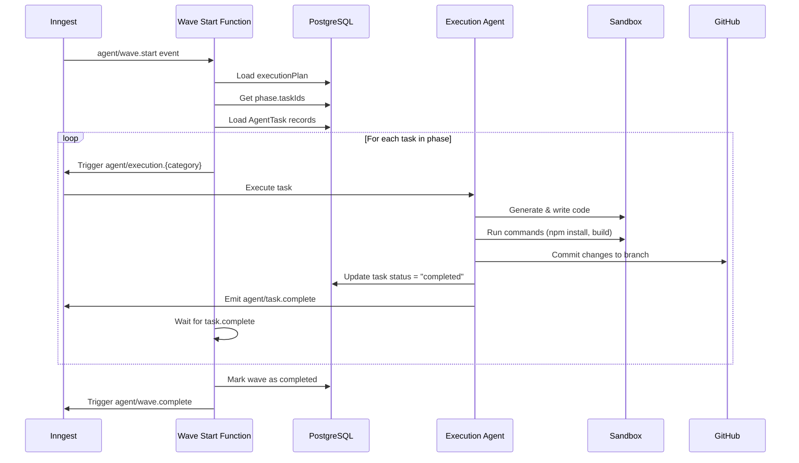
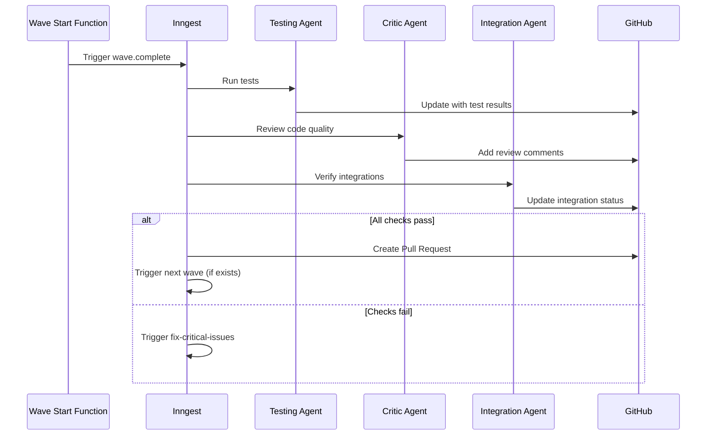
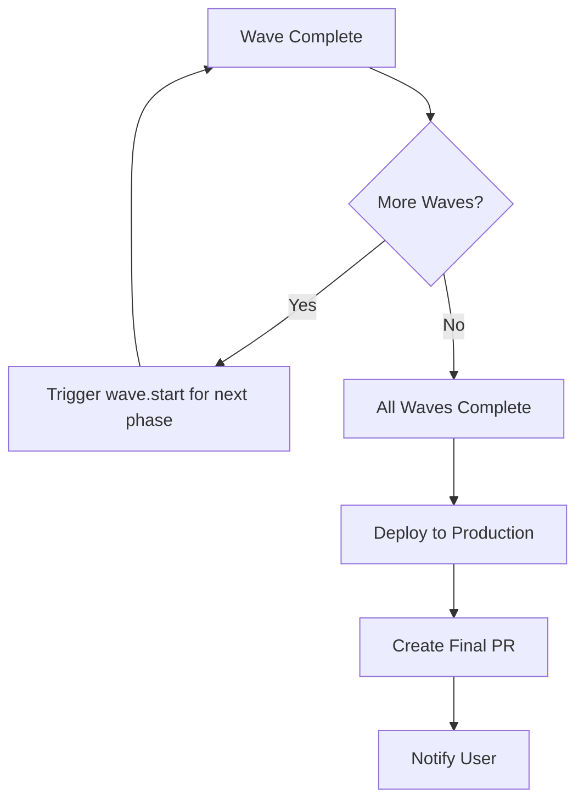
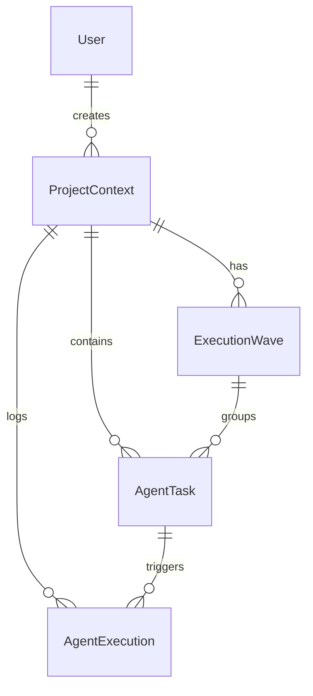
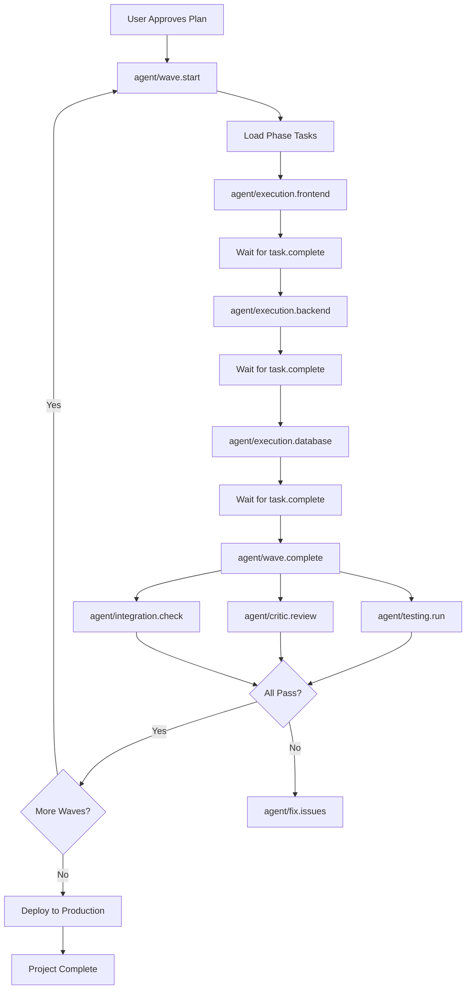

# NeuraLaunch Agentic System - Complete Architecture & Flow

## Table of Contents
1. [System Overview](#system-overview)
2. [High-Level Architecture](#high-level-architecture)
3. [Core Components](#core-components)
4. [Complete Execution Flow](#complete-execution-flow)
5. [Data Models & Relationships](#data-models--relationships)
6. [Agent Types & Responsibilities](#agent-types--responsibilities)
7. [Event-Driven Architecture](#event-driven-architecture)
8. [Troubleshooting Guide](#troubleshooting-guide)

---

## System Overview

NeuraLaunch is an AI-powered platform that converts user ideas (vision text or structured blueprints) into fully functional applications. The system uses multiple specialized AI agents that work together orchestrally to plan, build, test, and deploy software.

### Key Capabilities
- **Vision-to-App**: Converts freeform text descriptions into technical plans and working code
- **Blueprint-to-MVP**: Takes structured requirements and builds production-ready applications
- **Multi-Agent Orchestration**: Specialized agents handle planning, frontend, backend, database, infrastructure, testing, and quality assurance
- **Automated Workflows**: Event-driven architecture with background job processing via Inngest
- **Quality Assurance**: Built-in testing, code review, and deployment automation

---

## High-Level Architecture



---

## Core Components

### 1. Agent Orchestrator
**Location**: `src/lib/orchestrator/agent-orchestrator.ts`

**Purpose**: Coordinates the execution of all agents in the correct sequence through defined phases.

**Phases**:
1. **Analysis Phase**: Analyzes user requirements and extracts features
2. **Research Phase**: Researches best practices and technical approaches
3. **Validation Phase**: Validates requirements and feasibility
4. **Planning Phase**: Creates detailed execution plan with tasks and phases
5. **Plan Review Phase**: Waits for user to review and approve the plan
6. **Wave Execution Phase**: Executes tasks in sequential phases (waves)
7. **Completion Phase**: Final deployment and handoff

### 2. Planning Agent
**Location**: `src/lib/agents/planning/planning-agent.ts`

**Purpose**: Generates comprehensive execution plans with atomic tasks organized into phases.

**Key Features**:
- Supports two modes: Vision-based and Blueprint-based planning
- Uses Claude Sonnet 4.5 for superior JSON generation
- Generates Mermaid architecture diagrams
- Creates atomic tasks with dependencies
- Organizes tasks into sequential execution phases
- Stores execution plan in database with preserved task IDs

**Output Structure**:
```json
{
  "architecture": {
    "projectStructure": {...},
    "frontendArchitecture": {...},
    "backendArchitecture": {...},
    "databaseArchitecture": {...},
    "infrastructureArchitecture": {...},
    "diagrams": {
      "systemArchitecture": "mermaid diagram",
      "databaseSchema": "mermaid ERD",
      "dataFlow": "mermaid sequence diagram",
      "deployment": "mermaid deployment diagram"
    }
  },
  "tasks": [
    {
      "id": "task-001",
      "title": "Setup Next.js App",
      "category": "frontend",
      "priority": 1,
      "dependencies": [],
      "technicalDetails": {...},
      "acceptanceCriteria": [...]
    }
  ],
  "phases": [
    {
      "name": "Phase 1: Foundation",
      "taskIds": ["task-001", "task-002", "task-003"]
    }
  ]
}
```

### 3. Wave Start Function (Phase Execution)
**Location**: `src/inngest/functions/wave-start-function.ts`

**Purpose**: Executes all tasks in a phase sequentially, one at a time.

**Execution Flow**:
1. Load execution plan from database
2. Extract phase configuration (name + task IDs)
3. Setup GitHub repository (Phase 1 only)
4. Initialize sandbox environment
5. Load tasks from database:
   - Try to load by phase.taskIds
   - If not found, fall back to loading ALL pending tasks
6. Execute each task sequentially:
   - Trigger appropriate agent (Frontend, Backend, Database, Infrastructure)
   - Wait for task completion event
   - Move to next task
7. Mark phase complete
8. Trigger wave.complete event for quality checks

### 4. Execution Agents
**Locations**: `src/inngest/functions/*-agent-function.ts`

**Types**:
- **Frontend Agent**: Builds React/Next.js components, pages, and UI
- **Backend Agent**: Creates API routes, business logic, and services
- **Database Agent**: Designs schemas, creates models, writes migrations
- **Infrastructure Agent**: Sets up configuration, environment, deployment

**Execution Pattern** (all agents follow this):
1. Receive task via Inngest event
2. Load task details from database
3. Initialize sandbox environment
4. Generate code using AI (Claude/Gemini)
5. Write code to sandbox filesystem
6. Run commands (install deps, build, test)
7. Commit changes to GitHub branch
8. Update task status and output
9. Emit task.complete event

### 5. Quality Assurance Agents
**Locations**: `src/inngest/functions/*-agent-function.ts`

**Types**:
- **Testing Agent**: Runs tests, checks coverage, verifies functionality
- **Critic Agent**: Reviews code quality, identifies issues, suggests improvements
- **Integration Agent**: Verifies integrations work correctly
- **Monitoring Agent**: Sets up monitoring and logging

**Triggered After**: Each wave completes (via wave.complete event)

### 6. Sandbox Service
**Location**: `src/lib/services/sandbox-service.ts`

**Purpose**: Provides isolated Docker containers for each project where code is generated and tested.

**Features**:
- One sandbox per project
- File system operations (read, write, execute)
- Command execution (npm install, build, test)
- Git operations (init, commit, push)
- Port forwarding for preview deployments

---

## Complete Execution Flow

### Phase 1: User Creates Project



### Phase 2: AI Planning



### Phase 3: User Approves Plan



### Phase 4: Wave/Phase Execution



### Phase 5: Quality Checks



### Phase 6: Next Wave or Completion



---

## Data Models & Relationships

### ProjectContext
**Table**: `ProjectContext`

**Purpose**: Central record for each project containing all planning and execution state.

**Key Fields**:
```typescript
{
  projectId: string;              // Unique ID
  userId: string;                 // Owner
  conversationId: string;         // Related chat
  currentPhase: string;           // Current orchestration phase
  executionPlan: JSON;            // Full plan from Planning Agent
  originalPlan: JSON;             // Backup of original plan
  planApprovalStatus: string;     // "pending" | "approved" | "rejected"
  codebase: JSON;                 // Generated code info
}
```

### AgentTask
**Table**: `AgentTask`

**Purpose**: Individual task records that execution agents work on.

**Key Fields**:
```typescript
{
  id: string;                     // Task ID (e.g., "task-001")
  projectId: string;              // Parent project
  agentName: string;              // Which agent handles this
  status: string;                 // "pending" | "in_progress" | "completed" | "failed"
  priority: number;               // Execution order
  waveNumber: number;             // Which phase this belongs to
  branchName: string;             // Git branch
  prNumber: number;               // Pull request number
  input: JSON;                    // Task details (title, description, files, etc.)
  output: JSON;                   // Results (code, commands, files created)
  error: string;                  // Error message if failed
}
```

### ExecutionWave
**Table**: `ExecutionWave`

**Purpose**: Tracks progress of each phase/wave execution.

**Key Fields**:
```typescript
{
  projectId: string;
  waveNumber: number;             // Phase number (1, 2, 3, ...)
  status: string;                 // "in_progress" | "completed" | "failed"
  taskCount: number;              // Total tasks in this wave
  completedCount: number;         // How many completed
  startedAt: DateTime;
  completedAt: DateTime;
}
```

### AgentExecution
**Table**: `AgentExecution`

**Purpose**: Audit log of all agent executions.

**Key Fields**:
```typescript
{
  id: string;
  projectId: string;
  agentName: string;              // Which agent ran
  phase: string;                  // Which orchestration phase
  input: JSON;                    // Agent input
  output: JSON;                   // Agent output
  success: boolean;
  durationMs: number;
  error: string;
}
```

### Relationship Diagram



---

## Agent Types & Responsibilities

### Planning & Coordination

| Agent | Purpose | Input | Output |
|-------|---------|-------|--------|
| **Analyzer Agent** | Extracts features from requirements | Blueprint/Vision | Feature list |
| **Research Agent** | Researches best practices | Feature list | Technical recommendations |
| **Validation Agent** | Validates feasibility | Requirements | Validation results |
| **Planning Agent** | Creates execution plan | Validated requirements | ExecutionPlan with tasks & phases |

### Execution Agents

| Agent | Category | Responsibilities | Technologies |
|-------|----------|------------------|--------------|
| **Frontend Agent** | `frontend` | UI components, pages, routing, state management | React, Next.js, TailwindCSS |
| **Backend Agent** | `backend` | API routes, business logic, services, auth | Next.js API Routes, tRPC |
| **Database Agent** | `database` | Schema design, models, migrations, queries | Prisma, PostgreSQL |
| **Infrastructure Agent** | `infrastructure` | Config files, env setup, CI/CD, Docker | GitHub Actions, Vercel |

### Quality Assurance Agents

| Agent | Purpose | When Triggered | Output |
|-------|---------|----------------|--------|
| **Testing Agent** | Run tests, check coverage | After each wave | Test results, coverage report |
| **Critic Agent** | Code review, identify issues | After each wave | Review comments, quality score |
| **Integration Agent** | Verify integrations | After each wave | Integration status |
| **Monitoring Agent** | Setup monitoring | Final wave | Monitoring dashboard links |
| **Documentation Agent** | Generate docs | Final wave | README, API docs |
| **Optimization Agent** | Performance optimization | Final wave | Optimization report |

---

## Event-Driven Architecture

### Inngest Events

All background processing uses **Inngest** for reliable event-driven workflows.

#### Orchestration Events

| Event | Data | Triggered By | Handled By |
|-------|------|--------------|------------|
| `agent/orchestrator.run` | projectId, userId, conversationId, blueprint | User creates project | orchestratorRunFunction |
| `agent/orchestrator.vision` | projectId, userId, visionText, projectName | Agentic Interface | orchestratorVisionFunction |
| `agent/orchestrator.blueprint` | projectId, userId, blueprint, sprintData | Sprint Dashboard | orchestratorBlueprintFunction |

#### Execution Events

| Event | Data | Triggered By | Handled By |
|-------|------|--------------|------------|
| `agent/wave.start` | projectId, userId, conversationId, waveNumber | Plan approval or previous wave completion | waveStartFunction |
| `agent/execution.frontend` | taskId, projectId, userId, taskInput | Wave start function | frontendAgentFunction |
| `agent/execution.backend` | taskId, projectId, userId, taskInput | Wave start function | backendAgentFunction |
| `agent/execution.database` | taskId, projectId, userId, taskInput | Wave start function | databaseAgentFunction |
| `agent/execution.infrastructure` | taskId, projectId, userId, taskInput | Wave start function | infrastructureAgentFunction |
| `agent/task.complete` | taskId, projectId, success, output | Any execution agent | Wave start function (wait) |
| `agent/wave.complete` | projectId, userId, conversationId, waveNumber | Wave start function | Quality check agents |

#### Quality Assurance Events

| Event | Data | Triggered By | Handled By |
|-------|------|--------------|------------|
| `agent/testing.run` | projectId, waveNumber | wave.complete | testingAgentFunction |
| `agent/critic.review` | projectId, waveNumber | wave.complete | criticAgentFunction |
| `agent/integration.check` | projectId, waveNumber | wave.complete | integrationAgentFunction |

### Event Flow Diagram



---

## Troubleshooting Guide

### Issue: "No tasks found for Phase 1"

**Symptom**: Wave execution fails immediately with error message about no tasks found.

**Root Causes**:
1. Tasks were not created during planning
2. Task IDs in execution plan don't match task IDs in database
3. Tasks were created but then deleted
4. Tasks already assigned to a different wave

**Diagnosis Steps**:
```sql
-- 1. Check if execution plan exists and has phases
SELECT executionPlan->>'phases' 
FROM "ProjectContext" 
WHERE "projectId" = 'your-project-id';

-- 2. Check if tasks exist in database
SELECT id, "agentName", status, "waveNumber", priority
FROM "AgentTask"
WHERE "projectId" = 'your-project-id'
ORDER BY priority;

-- 3. Compare task IDs
-- The phase taskIds should match the task.id values
```

**Solutions**:

1. **Fallback Logic (Already Implemented)**:
   - The system now automatically falls back to loading ALL pending tasks if phase.taskIds don't match
   - Check logs for: `"Using fallback: loaded X pending tasks"`

2. **Re-run Planning**:
   ```typescript
   // Call the planning agent again to regenerate tasks
   POST /api/projects/{projectId}/agent/plan
   ```

3. **Manual Task Creation** (Emergency):
   ```typescript
   // Create tasks manually if planning failed
   await prisma.agentTask.createMany({
     data: [
       {
         id: "task-001",
         projectId: "proj_xxx",
         agentName: "FrontendAgent",
         status: "pending",
         priority: 1,
         input: {...}
       }
     ]
   });
   ```

### Issue: Tasks Execute but Nothing Appears in UI

**Symptom**: Wave starts, logs show tasks executing, but Activity/Code Files tabs are empty.

**Root Causes**:
1. Frontend not polling for updates
2. Tasks completing but not updating database
3. Sandbox not syncing with GitHub
4. API routes returning cached data

**Diagnosis**:
```bash
# Check task statuses
curl http://localhost:3000/api/projects/{projectId}/tasks

# Check if files exist in sandbox
curl http://localhost:3000/api/projects/{projectId}/files

# Check execution wave status
curl http://localhost:3000/api/projects/{projectId}/waves
```

**Solutions**:
1. Force refresh the UI (Ctrl+F5)
2. Check Inngest dashboard for failed jobs
3. Verify sandbox is running: `docker ps | grep {projectId}`
4. Clear Next.js cache: `rm -rf .next/cache`

### Issue: Agent Fails with "Timeout" Error

**Symptom**: Task starts but fails after 3 minutes with timeout error.

**Root Causes**:
1. AI API taking too long to respond
2. Complex task requires more thinking time
3. Network connectivity issues
4. Sandbox command hangs

**Solutions**:
1. Check the Inngest function timeout settings
2. Break complex tasks into smaller subtasks
3. Add retry logic with exponential backoff
4. Check AI API status (Anthropic, OpenAI)

### Issue: Git Push Fails

**Symptom**: Agent generates code but fails to push to GitHub.

**Root Causes**:
1. GitHub token expired or invalid
2. Repository doesn't exist
3. Branch already exists with conflicts
4. Git not configured in sandbox

**Solutions**:
```bash
# 1. Check GitHub token
SELECT "access_token" FROM "Account" WHERE "userId" = '{userId}' AND provider = 'github';

# 2. Re-authenticate with GitHub
# User needs to disconnect and reconnect GitHub in profile settings

# 3. Delete conflicting branch
git push origin --delete phase-1

# 4. Reinitialize git in sandbox
cd /sandbox/{projectId}
git init
git remote add origin {repo-url}
```

### Issue: Multiple Waves Running Simultaneously

**Symptom**: Logs show Phase 1 and Phase 2 executing at the same time.

**Root Cause**: Wave completion event triggered before previous wave actually finished.

**Solution**: Ensure `wave.complete` is only emitted after ALL tasks in the wave are done:
```typescript
// In wave-start-function.ts
await step.run("trigger-wave-complete", async () => {
  // Only trigger after ALL tasks completed
  await inngest.send({
    name: "agent/wave.complete",
    data: { projectId, waveNumber }
  });
});
```

### Debugging Tips

1. **Check Logs**: All agents use structured logging
   ```typescript
   import { logger } from '@/lib/logger';
   logger.info('Message', { context: 'data' });
   ```

2. **Inngest Dashboard**: View all running and failed jobs
   - Dev: http://localhost:8288
   - Prod: https://app.inngest.com

3. **Database Queries**: Use Prisma Studio
   ```bash
   npx prisma studio
   ```

4. **Sandbox Inspection**: Connect to running sandbox
   ```bash
   docker exec -it neuralaunch-{projectId} /bin/bash
   ```

5. **Event Tracing**: Follow event chain in logs
   ```bash
   # Search for projectId across all logs
   grep "proj_xxx" logs/*.log
   ```

---

## Best Practices

### For New Engineers

1. **Start with Examples**: Look at existing agent functions to understand patterns
2. **Follow Event Flow**: Use the sequence diagrams to understand how events flow
3. **Test Locally**: Use Inngest Dev Server for local testing
4. **Read Logs First**: Most issues can be diagnosed from logs
5. **Use Type Safety**: Leverage TypeScript for better developer experience

### For System Maintenance

1. **Monitor Inngest**: Check for failed jobs daily
2. **Database Backups**: ExecutionPlan and AgentTask data is critical
3. **Sandbox Cleanup**: Clean up old sandboxes regularly
4. **GitHub Token Rotation**: Handle token expiration gracefully
5. **Rate Limiting**: Monitor AI API usage to avoid rate limits

### For Adding New Agents

1. **Follow Existing Patterns**: Use existing agent functions as templates
2. **Emit Events**: Always emit task.complete when done
3. **Handle Errors**: Wrap in try/catch and update task status
4. **Update Database**: Store results in task.output
5. **Add Tests**: Test agent logic independently

---

## Additional Resources

### Code Locations
- **Orchestrator**: `src/lib/orchestrator/agent-orchestrator.ts`
- **Planning Agent**: `src/lib/agents/planning/planning-agent.ts`
- **Wave Execution**: `src/inngest/functions/wave-start-function.ts`
- **Execution Agents**: `src/inngest/functions/*-agent-function.ts`
- **API Routes**: `src/app/api/projects/[projectId]/**`
- **Database Schema**: `prisma/schema.prisma`

### External Documentation
- [Inngest Documentation](https://www.inngest.com/docs)
- [Next.js App Router](https://nextjs.org/docs/app)
- [Prisma ORM](https://www.prisma.io/docs)
- [Anthropic Claude API](https://docs.anthropic.com)

### Related Documents
- [Execution Fixes Applied](../../EXECUTION_FIXES_APPLIED.md)
- [Execution Issue Fix](../EXECUTION_ISSUE_FIX.md)
- [CORS Setup](./CORS_SETUP.md)
- [Timeouts and Caching](./TIMEOUTS_AND_CACHING.md)

---

**Document Version**: 1.0  
**Last Updated**: 2025-11-20  
**Maintained By**: NeuraLaunch Engineering Team  
**Status**: ✅ Complete
